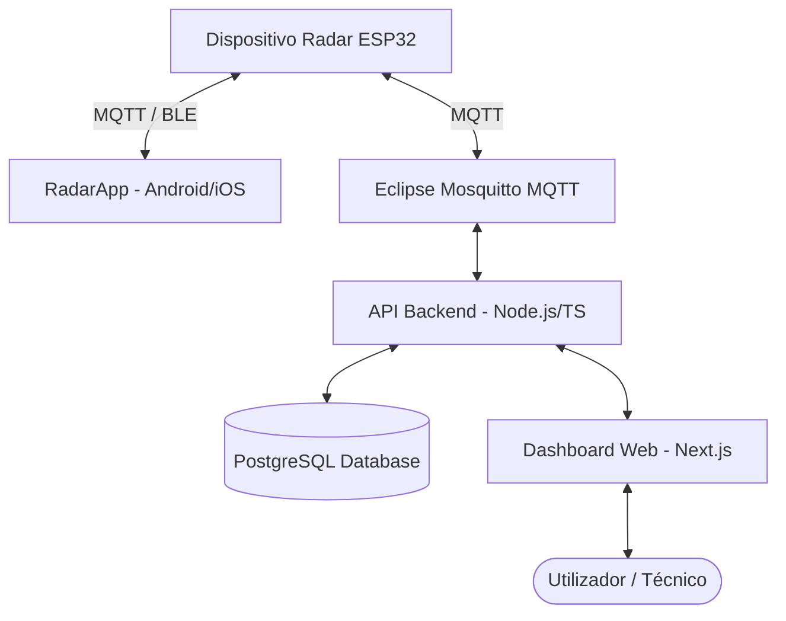

# Radar Care System (Radar_App Monorepo)

Este repositório contém a solução integrada para configuração, monitorização e diagnóstico de dispositivos de radar baseados em ESP32, concebidos para detecção de quedas e análise de movimento.

O ecossistema divide-se em duas componentes principais: a aplicação móvel (**RadarApp**) e a consola web local (**local-radar-stack**).

---

## 🛠️ Arquitetura do Sistema



---

## 📱 1. Aplicação Móvel (`RadarApp`)

A aplicação móvel foi desenvolvida em **React Native (TypeScript)** e destina-se a técnicos em campo para configuração inicial, provisionamento e diagnósticos imediatos.

### ✨ Funcionalidades Principais
*   **Ligação Avançada:** Provisionamento simplificado e suporte para o novo fluxo de ligação do firmware.
*   **Sensibilidade Ajustável:** Controlo dinâmico e direto dos níveis de sensibilidade estática e dinâmica do radar.
*   **Registo Completo (Logs):** Ecrã dedicado de diagnósticos em tempo real para visualizar toda a comunicação do stream MQTT e eventos enviados pelo dispositivo.
*   **Localização Completa:** Interface totalmente traduzida para **Português (PT-PT)**.

### 🚀 Como Compilar e Executar
1. Instale as dependências:
   ```bash
   cd RadarApp
   npm install
   ```
2. Para compilar o APK de Produção (Release) para Android:
   ```bash
   cd android
   ./gradlew assembleRelease
   ```
   *O APK final será gerado em: `android/app/build/outputs/apk/release/app-release.apk`*

---

## 💻 2. Consola de Administração Local (`local-radar-stack`)

Uma infraestrutura local totalmente dockerizada para visualização centralizada, auditoria e ajuste milimétrico dos dispositivos de radar.

### 🗂️ Componentes do Stack Docker
1.  **Dashboard Web (Next.js):** Interface rica com controlo passo-a-passo (`+`/`-`), importação/exportação de esquemas JSON completos e auditoria de logs.
2.  **API Backend (TypeScript/Express):** Inclui um buffer circular em memória (ring buffer) de 500 entradas para monitorização de eventos em tempo real, persistindo falhas e detecções críticas diretamente na base de dados.
3.  **Broker MQTT (Mosquitto):** Barramento central de comunicação para troca de mensagens com os sensores.
4.  **Base de Dados (PostgreSQL):** Persistência segura das configurações aplicadas, rooms, pacientes e eventos.

### ✨ Funcionalidades Avançadas do Dashboard
*   **Importação/Exportação JSON:** Permite carregar ou salvaguardar ficheiros de configuração inteiros para replicação rápida em novos sensores.
*   **Ajuste Fino:** Botões de incremento/decremento passo-a-passo para sintonia extremamente precisa de ângulos FOV e alturas de montagem.
*   **Secção de Logs Avançada:** Visualizador integrado de logs MQTT em tempo real com auto-scroll e filtros inteligentes de categorias e importância.

### 🚀 Como Iniciar o Stack Local
1. Configure as variáveis de ambiente baseadas nos ficheiros `.env.example`.
2. Inicie todo o ecossistema localmente via Docker:
   ```bash
   cd local-radar-stack
   docker compose up -d --build
   ```
3. Aceda aos serviços através do browser:
   *   **Dashboard Web:** [http://localhost:3000](http://localhost:3000)
   *   **API Backend:** [http://localhost:4000](http://localhost:4000)
   *   **Consola pgAdmin:** [http://localhost:5050](http://localhost:5050)

---

## 📡 3. Especificação de Tópicos MQTT

Toda a comunicação flui através de tópicos estruturados com o formato base `linovt/<device_id>/<suffix>`:

*   **Publicação de Configuração:** `linovt/<device_id>/radar/config` (Configuração completa em JSON)
*   **Estado de Aplicação:** `linovt/<device_id>/radar/cmd/status` (Retorna o feedback do hardware: Aplicado, Rejeitado, Falhou)
*   **Logs e Eventos:** `linovt/<device_id>/cmd/status` (Registo geral de telemetria e estado de ligação)

---

## 🔒 4. Boas Práticas de Segurança
*   **Exclusão de Credenciais:** Ficheiros com chaves de serviço GCP/Firebase (`firebase-service-account.json`) e ficheiros `.env` locais estão permanentemente excluídos do repositório através do `.gitignore`.
*   **Políticas de Push:** O repositório utiliza proteção contra pushes de segredos sensíveis para segurança robusta do código de produção.
